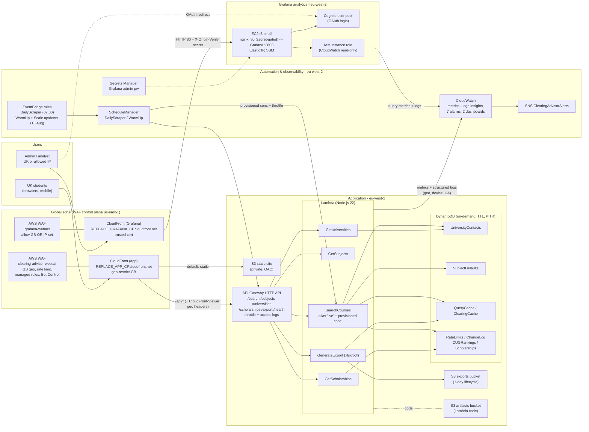

# UK Clearing Advisor - Architecture

Account REPLACE_ACCOUNT_ID. Region eu-west-2 (London); WAF/CloudFront are global with
control plane in us-east-1. Two subsystems: the public application and the
Grafana analytics, both geo-restricted to the UK.

## Diagram (Mermaid)



## Plain-text fallback

```
UK students ─▶ WAF(clearing-advisor) ─▶ CloudFront(app)
                                          ├─ default ─▶ S3 static site (private, OAC)
                                          └─ /api/*  ─▶ API Gateway HTTP API
                                                          ├─ SearchCourses (alias live, prov. concurrency)
                                                          ├─ GetSubjects / GetUniversities / GetScholarships
                                                          └─ GenerateExport ─▶ S3 exports
                                          Lambdas ─▶ DynamoDB (8 tables), emit metrics+logs ─▶ CloudWatch

EventBridge ─▶ ScheduleManager ─▶ SearchCourses provisioned concurrency + API throttle (Results Day)
EventBridge ─▶ DailyScraper / WarmUp
CloudWatch ─▶ alarms ─▶ SNS

Admin (UK or allowed IP) ─▶ WAF(grafana: GB OR IP) ─▶ CloudFront(Grafana, trusted cert)
                              └─▶ EC2 nginx:80 (secret) ─▶ Grafana:3000 (Elastic IP)
                                    ├─ Cognito (OAuth login)
                                    └─ IAM role ─▶ CloudWatch (reads app metrics + geo logs)
```

## Notes
- Everything user-facing is UK geo-restricted (WAF). The app uses CloudFront
  geo-restriction + WAF; Grafana uses WAF "GB OR allowed IP".
- No servers in the app tier (fully serverless). The only EC2 is the Grafana host.
- Elastic IP is used only where it makes sense: the Grafana instance.
- Live UCAS integration is the one external dependency still to add (needs a key);
  until then search runs on seeded data + national averages (flagged "estimated").
```


---

# Developer reference

The rendered diagram is `architecture.png` / `architecture.svg` (source:
`architecture.dot`, edit and run `dot -Tpng architecture.dot -o architecture.png`).

## CloudFormation stack inventory

| Stack | Region | Template | Owns |
|-------|--------|----------|------|
| uk-clearing-advisor-data | eu-west-2 | stacks/data.yaml | 8 DynamoDB tables |
| uk-clearing-advisor-compute | eu-west-2 | stacks/compute.yaml | 7 Lambdas, IAM roles, log groups, SearchCourses alias, DailyScraper/WarmUp schedules |
| uk-clearing-advisor-api | eu-west-2 | stacks/api.yaml | HTTP API REPLACE_API_ID, routes, throttle, access logs |
| uk-clearing-advisor-waf | us-east-1 | stacks/waf.yaml | App WAF clearing-advisor-webacl |
| uk-clearing-advisor-cdn | eu-west-2 | stacks/cdn.yaml | Site+exports buckets, CloudFront REPLACE_APP_DIST_ID, OAC, origin policies, CF function |
| uk-clearing-advisor-observability | eu-west-2 | stacks/observability.yaml | SNS, 7 alarms, metric filters, 2 dashboards |
| uk-clearing-advisor-scaling | eu-west-2 | stacks/scaling.yaml | ScheduleManager + Results-Day scale up/down |
| uk-clearing-advisor-grafana | eu-west-2 | stacks/grafana.yaml | EC2, EIP, SG, Cognito, instance role, admin secret |
| uk-clearing-advisor-grafana-front | us-east-1 | stacks/grafana-front.yaml | Grafana WAF + CloudFront REPLACE_GRAFANA_DIST_ID |

Artifacts bucket (Lambda code + provisioning): `uk-clearing-advisor-artifacts-REPLACE_ACCOUNT_ID`.

## "I want to change X" -> where

| Change | Edit | Then |
|--------|------|------|
| Search logic / ranking / badges / filters | lambda/SearchCourses/index.mjs | `build_lambdas.py`, upload as a NEW key `lambda/SearchCourses-vN.zip`, bump `S3Key` + rename `SearchCoursesVersionVN` in compute.yaml (alias must repoint), deploy compute |
| Add/edit a university | scripts/seed.py (UNIVERSITIES) | re-run `python3 scripts/seed.py` |
| Add/edit a subject or its UCAS codes | lambda/shared/shared.mjs (SUBJECTS / REQUIRED_SUBJECTS) | rebuild + redeploy SearchCourses (+ GetSubjects) |
| Specialist-subject school lists | lambda/SearchCourses/index.mjs (RESTRICTED_SUBJECTS) | rebuild + redeploy SearchCourses |
| National subject averages | scripts/seed.py (SUBJECT_DEFAULTS) | re-run seed |
| Frontend UI | frontend/* | `aws s3 sync frontend/ s3://uk-clearing-advisor-site-REPLACE_ACCOUNT_ID/ --delete` + CloudFront invalidation `/*` |
| API routes / throttle / CORS | stacks/api.yaml | deploy api |
| App WAF rules / Bot Control | stacks/waf.yaml (us-east-1) | deploy waf |
| Geo headers forwarded to API | stacks/cdn.yaml (ApiGeoOriginRequestPolicy, max 10 headers) | deploy cdn |
| Results-Day peak / throttle / dates | scaling.yaml params PeakConcurrency, UpRate/UpBurst, ScaleUpCron/ScaleDownCron | deploy scaling with --parameter-overrides |
| Alarms / dashboards / alert email | stacks/observability.yaml | deploy observability |
| Grafana access (who can reach it) | grafana-front WAF IPSet grafana-allowed-ips (us-east-1) for IPs; geo rule for countries | `aws wafv2 update-ip-set` |
| Grafana instance / SG / Cognito | stacks/grafana.yaml | deploy grafana |
| Grafana dashboard panels | grafana/dashboard.json | re-upload to artifacts + re-provision (or edit in UI) |

## Key config notes for future work
- SearchCourses is invoked via the `live` alias so provisioned concurrency works.
  Any code change needs a NEW published version + the alias repointed (see the
  vN pattern in compute.yaml) - editing $LATEST alone will not reach production.
- No live UCAS feed yet: search runs on seeded data + national averages and is
  flagged `estimatedData:true`. Wiring the UCAS API (Section 3 of the original
  brief) is the main path to true course-level accuracy; put the key in Secrets
  Manager and enable the fetch behind the existing feature flag.
- Grafana geomap depends on CloudFront forwarding `CloudFront-Viewer-*` headers
  on `/api/*` and SearchCourses logging geo fields - keep both if you refactor.
- CloudFront origin request policies allow at most 10 headers.
- Grafana origin is HTTP:80 gated by the `X-Origin-Verify` secret (self-signed
  cert can't be an HTTPS CloudFront origin); rotate the secret in both the
  grafana-front stack and the instance nginx if needed.
