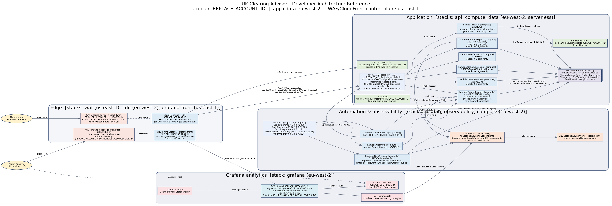

# UK Clearing Advisor

[](https://github.com/usmanmehr/uk-clearing-advisor/actions/workflows/cfn-lint.yml)

A UK-only, fully serverless web app that helps students find undergraduate
courses in UCAS Clearing, ranked by graduate employability and value for money,
plus a Grafana analytics stack showing where visitors come from.

Built on AWS with CloudFormation (S3, CloudFront, WAF, API Gateway, Lambda,
DynamoDB, EventBridge, CloudWatch, Cognito, EC2 for Grafana).

See [CHANGELOG.md](CHANGELOG.md) for what's changed between releases.



## Features
- Search by A-levels + subject interest; ranked shortlist by employability,
  salary, ranking or a balanced score.
- Estimated-data mode when no live UCAS feed is configured (seeded university
  contacts + national subject averages, clearly flagged). Wire the UCAS API for
  true course-level vacancies.
- UK-only access enforced at the edge (CloudFront geo-restriction + AWS WAF).
- Invisible anti-bot: WAF managed rules, per-IP rate limiting, honeypot field.
- PDF/XLSX export, daily change scraper, and Results-Day autoscaling.
- Grafana dashboard (UK visitor map, region/city/device breakdown, security).

## Quickstart - deploy your own
You deploy into your **own** AWS account. One script handles the whole
sequence (artifacts bucket, Lambda packaging, DynamoDB seed, and all the
stacks in the right order):

```bash
git clone https://github.com/usmanmehr/uk-clearing-advisor.git
cd uk-clearing-advisor
./deploy.sh
```

That deploys the core site + API. To also get monitoring, Results-Day
scaling, and the Grafana analytics dashboard:

```bash
export ADMIN_EMAIL=you@example.com
export GRAFANA_VPC_ID=vpc-xxxxxxxx
export GRAFANA_SUBNET_ID=subnet-xxxxxxxx
export GRAFANA_ALLOWED_CIDR=203.0.113.4/32
./deploy.sh --full
```

Full prerequisites, what each variable is for, troubleshooting, and teardown
steps are in **[DEPLOY.md](DEPLOY.md)**.

## Repository layout
```
deploy.sh      One-command deploy script (see DEPLOY.md)
stacks/        CloudFormation templates (data, compute, api, cdn, waf,
               observability, scaling, grafana, grafana-front)
lambda/        Node.js 22 handlers (zero external deps; AWS SDK v3 only)
frontend/      Vanilla HTML/CSS/JS static site
scripts/       seed.py (DynamoDB seed), build_lambdas.py (zip packager)
grafana/       Grafana dashboard model
architecture.* Diagram (png/svg) + Graphviz source
ARCHITECTURE.md  Developer reference (stack inventory + change guide)
DEPLOY.md      Deployment guide (prerequisites, deploy.sh usage, teardown)
```

## Prerequisites
See [DEPLOY.md](DEPLOY.md#1-prerequisites) for the full list with version
checks. In short: an AWS account with the CLI configured, Python 3, and Bash.
No Node/npm required - the Lambdas use only the AWS SDK bundled in the
Node.js 22 runtime. Graphviz is optional, only needed to re-render the diagram.

## Configure for your account
`deploy.sh` figures out account-specific values (bucket names, account ID)
automatically. The only things you supply yourself, and only if you want the
`--full` deploy (monitoring + scaling + Grafana), are environment variables:
`ADMIN_EMAIL`, `GRAFANA_VPC_ID`, `GRAFANA_SUBNET_ID`, `GRAFANA_ALLOWED_CIDR`.
See [DEPLOY.md](DEPLOY.md#4-full-deploy-adds-monitoring-scaling-grafana) for
what each one is and how to find it.

No secrets are committed. `deploy.sh` generates the Grafana admin password
into Secrets Manager and the CloudFront<->API shared secret at deploy time,
reusing the same values on every re-run so re-deploying never breaks a
working site.

## Deploy
Use `./deploy.sh` (see Quickstart above and [DEPLOY.md](DEPLOY.md) for full
details, prerequisites, and troubleshooting). If you need to deploy stacks
individually or understand exactly what the script does under the hood, read
the source - it's a straightforward sequential script, not a build system.

See `ARCHITECTURE.md` for the full stack inventory and a "where to change what"
guide.

## Security notes
- Access is UK-restricted by design. Do not open security groups or WAF to
  `0.0.0.0/0` in production.
- The Grafana front door uses a trusted CloudFront certificate; the EC2 origin
  is HTTP behind a secret header and locked to the CloudFront prefix list.

## Data accuracy
Without a live UCAS feed, results are estimates and status badges are
university-level (labelled as such). Confirm course-level Clearing availability
with the university on Results Day. Integrating the UCAS Clearing API is the
path to authoritative, course-level data.

## Contributing
See [CONTRIBUTING.md](CONTRIBUTING.md). CI runs `cfn-lint` on every push to the
templates.

## Branch protection (recommended)
Protect `main` so changes go through review and CI. On GitHub:
**Settings -> Branches -> Add branch ruleset** (or "Add rule") targeting `main`:
- Require a pull request before merging (at least 1 approval).
- Require status checks to pass -> select **Validate CloudFormation** (cfn-lint),
  and "Require branches to be up to date before merging".
- Block force pushes and branch deletion.
- Optional: require linear history and signed commits.

This keeps the linted, reviewed state on `main` and prevents accidental direct
pushes or force-pushes.

## License
MIT - see [LICENSE](LICENSE).
